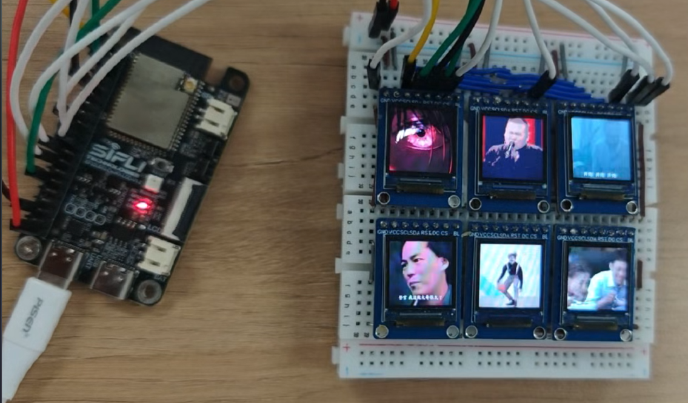

# 多个屏幕显示GIF图片
## 支持的平台
<!-- 支持哪些板子和芯片平台 -->
+ sf32lb52-lcd_n16r8

## SiFli-SDK版本
选择SDK版本v2.4.2或更高

## 概述
<!-- 例程简介 -->
这个是一个基于`GC9107`屏驱为基础的，多个`128*128`的`ZJY085-1212TBWIG42`屏幕组合成一个大的屏幕。可以实现每个屏幕显示内容不同，同时可以随意组合屏幕，比如六个屏幕，可以2x3,3x2,1x6等进行排列组合显示不同内容。主要的修改屏驱内容请查看[屏驱修改介绍](gc9107_Multi_screen\README.md)

## 介绍
本项目是基于 LVGL 图形库的多屏幕 GIF 显示系统，主要实现了在 6 个屏幕上独立控制 GIF 动画播放的功能。通过按键交互可以动态调整激活的屏幕数量，支持每个屏幕独立的 GIF 播放、暂停和重置。通过按键输入切换激活的屏幕数量，每次按键触发后，系统会循环切换 1-6 个屏幕的激活状态，激活的屏幕会自动从头开始播放 GIF 动画

## 目录结构介绍
主要介绍当前工程目录下的所存放和实现的内容，以便于更好的理解文档
```
multi-screen_gif                #实现多个屏幕显示GIF动画
│
├──asset                        #存放图片
│   ├──common
│   │   ├──ezip                 #存放ezip图片
│   │   └──gif                  #存放gif图片
│   └──SConscript               #编译链接文件以及转换gif与ezip图片为二进制数组文件
|
├──assets                       #存放readme内的图片
|
├──gc9107_Multi_screen          #屏幕屏驱     
│   ├──assets                   #存放readme内的图片
│   ├──gc9107_Multi_screen.c    #屏驱的实现
│   ├──README.md                #屏驱代码介绍
│   └──SConscript               #编译链接文件
│    
├──project                      #屏幕模组的menuconfig菜单定义和屏驱IC宏定义以及编译文件存放处
│   
├──src
│   ├──main                 
│   ├──screen.c                 #屏幕显示gif实现
│   ├──screen.h             
│   └──SConscript               #编译链接文件
│ 
└──README.md                    #多个屏幕显示GIF动画内容讲解
```

## 硬件需求
运行该例程前，需要准备一块本例程支持的开发板
如下以六个屏幕为例，屏幕与开发板的连线和引脚说明<br>
所有屏幕相同引脚全部与开发板对应引脚相连(进行串行连接)：
|开发板引脚|屏幕引脚  |
|:---|:---|  
|GND      |GND|   
|VCC(3.3) |VCC|  
|PA04     |SCL|   
|PA05     |SDA|  
|PA00     |RST|  
|PA06     |DC |   
|VCC      |BL |  

各个屏幕的 CS 引脚分别与开发板对应GPIO引脚相连（可以自行添加或者减少屏幕）：  
|屏幕|LCD1 |LCD2 |LCD3 |LCD4 |LCD5 |LCD6 | ···  |    
|:---|:---|:---|:---|:---|:---|:---|:---| 
|CS与开发板引脚 |PA03 |PA25 |PA29 |PA37 |PA38 |PA24 |···  |  

## 软件介绍
### GIF 动画控制
- 为每个 GIF 创建独立的刷新定时器，帧率可通过 GIF_SPEED 参数调整，实现了 GIF 的播放、暂停、重启等状态管理功能,支持动态加载不同的 GIF 资源
```c
#define GIF_SPEED 100 
/**
 * GIF refresh timer callback function  
 */
static void gif_refresh_timer_cb(lv_timer_t *timer)
{
    ScreenLayout *screen = (ScreenLayout *)timer->user_data;
    if (screen && screen->gif_obj) {
        int ret = lv_gif_dec_next_frame(screen->gif_obj);
        if (ret == 0) {
            lv_gif_dec_restart(screen->gif_obj);
        }
    }
}
```
### 多屏布局
- 采用 2 行 3 列的网格布局，每个屏幕尺寸为 128×128 像素，通过坐标偏移实现多屏排列。这里的布局需要和屏驱内部布局保持一致。
```c
// Define the layout of 6 screens, each with a GIF control
static ScreenLayout screens[6] = {
    {0, 0, &gif1, NULL, NULL, false},
    {SCREEN_WIDTH, 0, &gif2, NULL, NULL, false},
    {SCREEN_WIDTH*2, 0, &gif3, NULL, NULL, false},
    {0, SCREEN_HEIGHT, &gif4, NULL, NULL, false},
    {SCREEN_WIDTH, SCREEN_HEIGHT, &gif5, NULL, NULL, false},
    {SCREEN_WIDTH*2, SCREEN_HEIGHT, &gif6, NULL, NULL, false}
};
```

### 动画控制机制
- 每个 GIF 控件关联独立的定时器，通过回调函数驱动帧更新，实现流畅动画播放。当一帧播放完成（ret == 0）时自动重启，形成循环播放效果。
```c
static void gif_refresh_timer_cb(lv_timer_t *timer)
{
    ScreenLayout *screen = (ScreenLayout *)timer->user_data;
    if (screen && screen->gif_obj) {
        int ret = lv_gif_dec_next_frame(screen->gif_obj);
        if (ret == 0) {
            lv_gif_dec_restart(screen->gif_obj);
        }
    }
}
```

### 屏幕激活管理
- 该函数根据传入的激活屏幕数量，动态控制各屏幕的播放 / 暂停状态，确保资源合理利用。
```c
static void update_screen_active(int count)
{
    for (int i = 0; i < 6; i++) {
        bool new_active = (i < count);
        
        if (new_active != screens[i].active) {
            screens[i].active = new_active;
            
            if (screens[i].refresh_timer) {
                if (new_active) {
                    lv_gif_dec_restart(screens[i].gif_obj);
                    lv_timer_resume(screens[i].refresh_timer);
                } else {
                    lv_timer_pause(screens[i].refresh_timer);
                }
            }
        }
    }
}
```

### 按键处理
- 实现激活屏幕数量的循环切换（1-6 个），每次按键触发状态更新。
```c
static int32_t default_keypad_handler(lv_key_t key, lv_indev_state_t event)
{
    if ((LV_INDEV_STATE_PR == event) && (LV_KEY_HOME == key)) {
        active_count = (active_count % 6) + 1;
        update_screen_active(active_count);
    }
    return LV_BLOCK_EVENT;
}
```
 
## 修改GIF动画 
GIF文件存放于`multi-screen_gif\asset\common\gif`下。如果想修改GIF图片，需要先把GIF图片的分辨率改成128x128，以便于适应屏幕的大小，同时把需要替换的GIF图片删除，把新加入的GIF图片的名称改为需要替换的GIF图片名称。正常编译运行就可以实现更换GIF动画<br>

## 修改屏幕数量以及屏幕的排列顺序
1. 如果需要修改屏幕数量以及屏幕排列顺序，特别是增加或者减少屏幕纵向的排列数量，需要修改LVGL内部的`LV_FB_LINE_NUM`参数，及FrameBuffer的行像素数据，应该小于等于当前屏幕纵向宽度，如：屏幕分辨率为256x128，则`LV_FB_LINE_NUM <= 128`。<br>
2. 参考[屏驱修改](gc9107_Multi_screen\README.md)中针对屏幕数量修改以及屏幕的排列顺序修改等，明确描述如何接其他数量的屏幕需要如何改动，进行此例程扩展为其他数量屏幕的驱动。

## 演示视频
下图是正常演示的效果视频和照片，可以看到六个屏幕同时显示不同的图片，并且显示不同的内容<br>
根据[演示视频](https://www.bilibili.com/video/BV1LD8LzbELL/?vd_source=578afc404b2e128afdb532ff6943789d)查看演示效果。<br>
显示图片如下：
<br>

## DMP查看图像
如果屏幕出现异常如：花屏，不亮等情况，可以通过[数据转换为图像(BMP)的工具使用方法](https://docs.sifli.com/projects/sdk/latest/sf32lb52x/app_note/bin2bmp.html)查看如何使用脚本获取图像信息。
本主要用于将原始二进制数据（bin）转换为标准位图图像（BMP）。其核心功能是将非图像格式的二进制数据（如像素数组、传感器数据等）解析并编码为可视化的BMP图像文件。

## 异常诊断
```{warning}
1、如果出现花屏的状况，首先通过降低频率，之后观察演示效果
2、如果显示不正常，首先观察连接的线是否正确，检查排线特别是各个屏幕的CS引脚连线，观察LOG是否有初始化信息
3、屏幕与开发板连接线不易过长，连接线越长会影响频率，只能降低频率来正常显示  
```

## 更新记录
|版本 |日期   |发布说明 |
|:---|:---|:---|
|0.0.1 |7/2025 |初始版本 |
| | | |
| | | |


      
