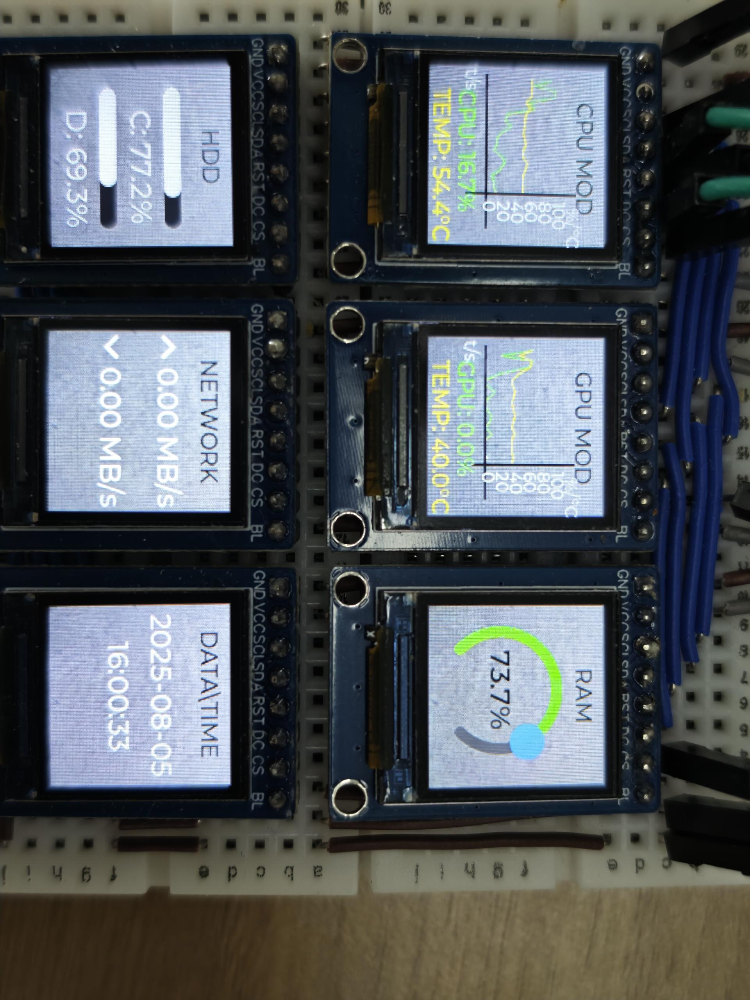

# 多个屏幕显示GIF图片
## 支持的平台
+ sf32lb52-lcd_n16r8

## SiFli-SDK版本
选择SDK版本v2.4.2或更高

## 概述
这个是一个基于`GC9107`屏驱为基础的，多个`128*128`的`ZJY085-1212TBWIG42`屏幕组合成一个大的屏幕。可以实现每个屏幕显示内容不同，同时可以随意组合屏幕，比如六个屏幕，可以2x3,3x2,1x6等进行排列组合显示不同内容。主要的修改屏驱内容请查看[屏驱修改介绍](gc9107_Multi_screen\README.md)

## 介绍
该程序是一个基于 LVGL（嵌入式图形库）监控 PC 获取数据界面应用。其核心功能是通过 UART 串口接收 PC 的监控数据（如 CPU/GPU 使用率、温度、内存占用、磁盘使用率、网络速率及时间信息等），并在由 6 个分屏幕组成的界面上以可视化方式（图表、进度条、文本标签等）实时展示这些数据。监控数据主要是通过脚本获取，将数据传送至串口。程序具备模块化的屏幕布局设计、数据解析逻辑和实时更新机制，适用于小型嵌入式显示设备（如 128x128 分辨率的屏幕）的系统监控场景。

## 目录结构介绍
主要介绍当前工程目录下的所存放和实现的内容，以便于更好的理解文档
```
multi-screen_pc                     #实现多个屏幕显示PC监控数据
│
├──asset                            #存放图片
│   ├──ezip                         #存放图片（可以存放ezip的外面，不对图片进行压缩处理）
│   └──SConscript                   #编译链接文件以及图片为二进制数组文件
|
├──assets                           #存放readme内的图片
|
├──gc9107_Multi_screen              #屏幕屏驱     
│   ├──assets                       #存放readme内的图片
│   ├──gc9107_Multi_screen.c        #屏驱的实现
│   ├──README.md                    #屏驱代码介绍
│   └──SConscript                   #编译链接文件
│    
├──project                          #屏幕模组的menuconfig菜单定义和屏驱IC宏定义以及编译文件存放处
│   
├──src
│   ├──main                 
│   ├──screen.c                     #屏幕显示实现
│   ├──screen.h             
│   └──SConscript                   #编译链接文件
│
├──python                       
│   ├──pc.py                        #获取PC数据脚本文件
│   └──LibreHardwareMonitorLib.dll  #脚本所需的库文件
│ 
└──README.md                        #多个屏幕显示PC 监控信息内容讲解
```

## 硬件需求
运行该例程前，需要准备一块本例程支持的开发板
如下以六个屏幕为例，屏幕与开发板的连线和引脚说明<br>
所有屏幕相同引脚全部与开发板对应引脚相连(进行串行连接)：
|开发板引脚|屏幕引脚  |
|:---|:---|  
|GND      |GND|   
|VCC(3.3) |VCC|  
|PA04     |SCL|   
|PA05     |SDA|  
|PA00     |RST|  
|PA06     |DC |   
|VCC      |BL |  

各个屏幕的 CS 引脚分别与开发板对应GPIO引脚相连（可以自行添加或者减少屏幕）：  
|屏幕|LCD1 |LCD2 |LCD3 |LCD4 |LCD5 |LCD6 | ···  |    
|:---|:---|:---|:---|:---|:---|:---|:---| 
|CS与开发板引脚 |PA03 |PA25 |PA29 |PA37 |PA38 |PA24 |···  |  

## 脚本配置
1、脚本存放于`multi-screen_pc\python`目录下,运行脚本之前需要，首先安装依赖的库文件，`pip install psutil pyserial pythonnet`,
2、查看`python\LibreHardwareMonitorLib.dll`是否为最新的版本，如果编译报错，可获取[最新的版本](https://github.com/LibreHardwareMonitor/LibreHardwareMonitor/releases)，找到对应的库文件(从网络下载的 DLL 文件可能被 Windows 标记为"不安全"，
导致加载失败:右键`LibreHardwareMonitorLib.dl1`→属性,若底部有"解除锁定"选项，勾选后点击"确定)。本库文件主要获取CPU和GPU利用率和温度主要从这里获取然后通过脚本传送数据，如果有数据获取不到（可能是PC配置太低或者显卡版本不支持获取），对应的值会变成 0 来显示。
3、根据实际的串口修改`port = 'COM '`的值，修改完运行脚本。
```py
class PCMonitor:
    def __init__(self, port='COM3', baudrate=1000000, timeout=1, dll_path="./LibreHardwareMonitorLib"):
        try:
            self.serial_port = serial.Serial(
                port=port,
                baudrate=baudrate,
                parity=serial.PARITY_NONE,
                stopbits=serial.STOPBITS_ONE,
                bytesize=serial.EIGHTBITS,
                timeout=timeout
            )

    #其他代码

if __name__ == "__main__":
    # 根据实际情况修改串口参数和DLL路径
    monitor = PCMonitor(
        port='COM3',     #修改串口
        baudrate=1000000,
        dll_path="./LibreHardwareMonitorLib"  # 替换为实际的DLL路径，默认是在同级目录下存放库文件
    )
    monitor.run(other_interval=1, time_interval=0.5) #时间是每0.5s传输一次一下，其他的数据是每1s数据传输一次
```
脚本是分两次进行数据的发送，时间单独发送以0.5发送一次，其他的一起发送以1s发送一次，这样保证时间的数据获取及时，
**注意**
有些电脑显卡版本太老不支持获取数据，这里获取不到数据就显示为 0。

## Finsh命令数据解析
* 在`python\cmd_parser.c`内 Finsh 命令数据解析函数。
通过`sys_set_cmd`命令行工具，支持通过 `sys_set_cmd <key> <value>` 格式动态配置 CPU、GPU、存储、网络等系统状态变量及日期时间等六个监控屏幕，支持动态数据刷新。每个屏幕显示不同的系统监控信息，包括图表、进度条、标签等，通过 `update_screen_display` 定时器函数，自动刷新各项监控数据。支持通过命令行 `sys_set_cmd` 指令设置各项监控数据，便于调试和外部数据对接。
```c
static void sys_set_cmd(int argc, char **argv)
{
    if (argc != 3) return;

    const char *key = argv[1];
    const char *value = argv[2];
    if (strcmp(key, "cpu_usage") == 0) {
        system_status.cpu_usage = atof(value);
        system_status.has_monitor_data = true;
    }
    //...
}
MSH_CMD_EXPORT(sys_set_cmd, Set system status variables);
```

## UI 元素创建
* 该模块负责创建各类可视化组件，为不同屏幕提供基础 UI 元素。 <br>
1、如创建带网格效果的圆形进度条。<br>
基于 LVGL 的 lv_arc 组件创建圆形进度条，配置外框颜色、填充颜色、线宽等样式，禁用交互功能，适用于内存使用率（RAM）等需要环形展示的指标。
```c
static lv_obj_t *create_grid_arc(lv_obj_t *parent, int16_t x, int16_t y, int16_t size)
{
    // 创建圆形进度条（lv_arc）
    lv_obj_t *arc = lv_arc_create(parent);
    lv_obj_set_size(arc, size, size);
    lv_obj_set_pos(arc, x, y);
    // 配置为圆形（0-360度）
    lv_arc_set_angles(arc, 0, 360);
    lv_arc_set_range(arc, 0, 100);
    lv_arc_set_value(arc, 0); 
    // 禁用交互
    lv_obj_clear_flag(arc, LV_OBJ_FLAG_CLICKABLE);
    // 样式：外框小格子效果
    lv_obj_set_style_arc_color(arc, lv_color_hex(0x444444), LV_PART_MAIN);
    lv_obj_set_style_arc_width(arc, 8, LV_PART_MAIN);
    // 样式：已填充进度条
    lv_obj_set_style_arc_color(arc, lv_color_hex(0x00FF00), LV_PART_INDICATOR);
    lv_obj_set_style_arc_width(arc, 8, LV_PART_INDICATOR);
    // 中心背景色
    lv_obj_set_style_bg_opa(arc, LV_OPA_TRANSP, LV_PART_MAIN);
    lv_obj_set_style_bg_color(arc, lv_color_hex(0x000000), LV_PART_MAIN);
    return arc;
}
```

2、创建黑底白条进度条。<br>
基于 LVGL 的 lv_bar 组件创建条形进度条，设置黑色背景、白色进度条样式和圆角效果，适用于磁盘使用率（C/D 盘）等线性比例指标。
```c
static lv_obj_t *create_black_white_bar(lv_obj_t *parent, int16_t x, int16_t y, int16_t w, int16_t h)
{
    lv_obj_t *bar = lv_bar_create(parent);
    lv_obj_set_size(bar, w, h);
    lv_obj_set_pos(bar, x, y);
    lv_bar_set_range(bar, 0, 100);
    // 黑底样式
    lv_obj_set_style_bg_color(bar, lv_color_hex(0x222222), LV_PART_MAIN);
    lv_obj_set_style_bg_opa(bar, LV_OPA_COVER, LV_PART_MAIN);
    lv_obj_set_style_radius(bar, h/2, LV_PART_MAIN);
    // 白条进度样式
    lv_obj_set_style_bg_color(bar, lv_color_hex(0xFFFFFF), LV_PART_INDICATOR);
    lv_obj_set_style_bg_opa(bar, LV_OPA_COVER, LV_PART_INDICATOR);
    return bar;
}
```
3、创建双线图表。<br>
基于 LVGL 的 lv_chart 组件创建支持两条数据线的图表，配置坐标轴、刻度标签、线条颜色和宽度，支持数据滚动更新（LV_CHART_UPDATE_MODE_SHIFT），适用于 CPU/GPU 使用率与温度的趋势展示。  
```c
static lv_obj_t *create_dual_line_chart(
    lv_obj_t *parent, 
    int16_t x, 
    int16_t y, 
    int16_t w, 
    int16_t h, 
    lv_color_t line1_color, 
    lv_color_t line2_color,
    lv_chart_series_t **series1,
    lv_chart_series_t **series2
) {
}
```


## 屏幕布局与初始化
1、该模块负责初始化分屏幕布局并创建各屏幕专属 UI 元素。<br>
先获取指定索引的屏幕布局信息和父容器对象，为每个屏幕创建标题标签，并设置标题文本、位置和字体样式，根据屏幕索引（screen_idx）的不同，通过 switch-case 结构创建对应类型的屏幕元素：
- 索引 0（CPU 模块）和 1（GPU 模块）：创建双线路图表和显示使用率、温度的富文本标签
- 索引 2（内存模块）：创建圆形进度条和中心数值标签
- 索引 3（硬盘模块）：创建 C 盘和 D 盘两个进度条及对应的标签
- 索引 4（网络模块）：创建上传和下载速度标签，分别显示上传 / 下载箭头和速率
- 索引 5（日期时间模块）：创建日期标签和时间标签，分别显示日期和时间
```c
static void create_screen_ui(int screen_idx)
{
        ScreenLayout *screen = &screen_layout[screen_idx];
    lv_obj_t *parent = screen->img_obj;
    
    // 标题
    screen->title_label = lv_label_create(parent);
    lv_label_set_text(screen->title_label, screen_titles[screen_idx]);
    lv_obj_align(screen->title_label, LV_ALIGN_TOP_MID, 0, 5);
    lv_obj_set_style_text_font(screen->title_label, TITLE_FONT, 0);

    //...
}
```

2、多屏幕初始化主函数。<br>
初始化 6 个分屏幕的背景图和位置，调用 create_screen_ui() 为每个屏幕创建 UI 元素，创建定时器触发数据更新，并启动 UART 初始化，是程序 UI 启动的入口
```c
void create_multi_screen_ui(void)
{
    lv_obj_t *scr = lv_scr_act();
    if (!scr) {
        rt_kprintf("Failed to get the LVGL home screen!\n");
        return;
    }
    // 初始化6个屏幕
    for (int i = 0; i < SCREEN_COUNT; i++) {
        // 背景图
        screen_layout[i].img_obj = lv_img_create(scr);
        lv_obj_set_size(screen_layout[i].img_obj, SCREEN_WIDTH, SCREEN_HEIGHT);
        lv_obj_set_pos(screen_layout[i].img_obj, screen_layout[i].x, screen_layout[i].y);
        lv_img_set_src(screen_layout[i].img_obj, screen_layout[i].src); 
        // 背景边框
        lv_obj_set_style_border_width(screen_layout[i].img_obj, 1, 0);
        lv_obj_set_style_border_color(screen_layout[i].img_obj, lv_color_hex(0x333333), 0);
        // 创建UI元素
        create_screen_ui(i);
    }
    // 定时器更新数据（500ms一次）
    lv_timer_t *update_timer = lv_timer_create(update_screen_display, 500, NULL); 

}
```

## 数据更新
1、定时器驱动的数据更新函数。
每 500ms 触发一次，根据 system_status 结构体中的最新数据更新各屏幕 UI：时间屏幕：更新日期和时间标签；CPU/GPU 屏幕：更新图表数据和数值标签；RAM 屏幕：更新圆形进度条数值；磁盘屏幕：更新条形进度条和使用率标签；网络屏幕：更新上传 / 下载速率标签
```c
static void update_screen_display(lv_timer_t *timer)
{
    char buf[50];
    // 更新时间屏幕（如果时间数据已更新）
    if (system_status.has_time_data) {
        char date[20], time_str[10];
        sscanf(system_status.datetime, "%s", date);
        lv_label_set_text(screen_layout[5].date_label, date);
        sscanf(system_status.datetime, "%*s %s", time_str);
        lv_label_set_text(screen_layout[5].time_label, time_str);
        system_status.has_time_data = false;
    }
    //...
}
```


## 多屏布局
- 采用 2 行 3 列的网格布局，每个屏幕尺寸为 128×128 像素，通过坐标偏移实现多屏排列。这里的布局需要和屏驱内部布局保持一致。
```c
// 屏幕布局配置
static ScreenLayout screen_layout[SCREEN_COUNT] = {
    {0, 0, &img1, NULL, NULL, NULL, NULL, NULL, NULL, NULL, NULL, NULL, NULL, NULL, NULL, NULL, NULL},
    {SCREEN_WIDTH, 0, &img1, NULL, NULL, NULL, NULL, NULL, NULL, NULL, NULL, NULL, NULL, NULL, NULL, NULL, NULL},
    {SCREEN_WIDTH*2, 0, &img1, NULL, NULL, NULL, NULL, NULL, NULL, NULL, NULL, NULL, NULL, NULL, NULL, NULL, NULL},
    {0, SCREEN_HEIGHT, &img1, NULL, NULL, NULL, NULL, NULL, NULL, NULL, NULL, NULL, NULL, NULL, NULL, NULL, NULL},
    {SCREEN_WIDTH, SCREEN_HEIGHT, &img1, NULL, NULL, NULL, NULL, NULL, NULL, NULL, NULL, NULL, NULL, NULL, NULL, NULL, NULL},
    {SCREEN_WIDTH*2, SCREEN_HEIGHT, &img1, NULL, NULL, NULL, NULL, NULL, NULL, NULL, NULL, NULL, NULL, NULL, NULL, NULL, NULL}
};
```
## 修改背景图片
GIF文件存放于`multi-screen_gif\asset\ezip`下。如果想修改背景图片，需要先把图片的分辨率改成128x128，以便于适应屏幕的大小，同时把需要替换的图片删除，把新加入的图片的名称改为需要替换的图片名称。正常编译运行就可以实现更换GIF动画<br>

## 修改屏幕数量以及屏幕的排列顺序
1. 如果需要修改屏幕数量以及屏幕排列顺序，特别是增加或者减少屏幕纵向的排列数量，需要修改LVGL内部的`LV_FB_LINE_NUM`参数，及FrameBuffer的行像素数据，应该小于等于当前屏幕纵向宽度，如：屏幕分辨率为256x128，则`LV_FB_LINE_NUM <= 128`。<br>
2. 参考[屏驱修改](gc9107_Multi_screen\README.md(lcd_screen))中针对屏幕数量修改以及屏幕的排列顺序修改等，明确描述如何接其他数量的屏幕需要如何改动，进行此例程扩展为其他数量屏幕的驱动。

## DMP查看图像
如果屏幕出现异常如：花屏，不亮等情况，可以通过[数据转换为图像(BMP)的工具使用方法](https://docs.sifli.com/projects/sdk/latest/sf32lb52x/app_note/bin2bmp.html)查看如何使用脚本获取图像信息。
本主要用于将原始二进制数据（bin）转换为标准位图图像（BMP）。其核心功能是将非图像格式的二进制数据（如像素数组、传感器数据等）解析并编码为可视化的BMP图像文件。

## 演示
下图是正常演示的照片，可以看到六个屏幕同时显示不同的获取 PC 的数据<br>
显示图片如下：
<br>

## 更新记录
|版本 |日期   |发布说明 |
|:---|:---|:---|
|0.0.1 |8/2025 |初始版本 |
| | | |
| | | |


      
