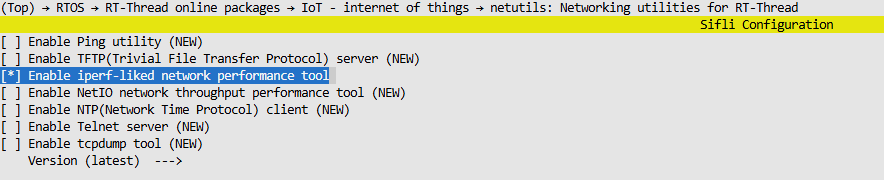
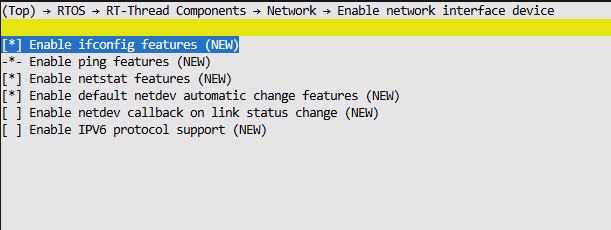
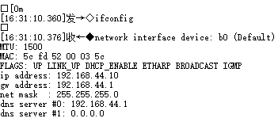
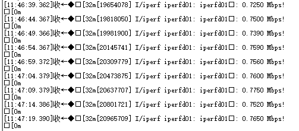
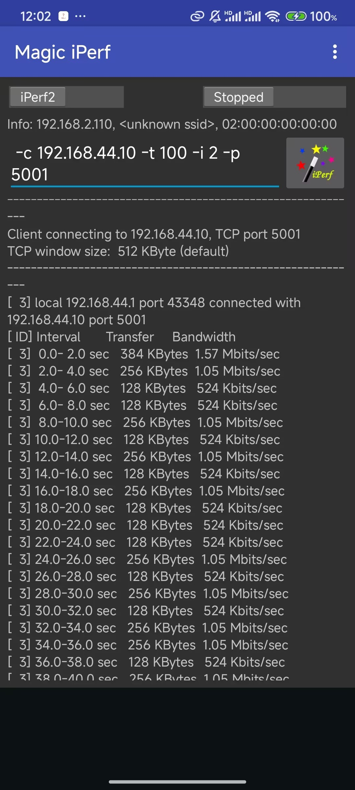

# Bluetooth PAN Network Upstream and Downstream Speed Test

## 1 Test Environment Configuration

### Hardware

- **Test Device**: sf32lb56-lcd_a1218r12n1  
- **Mobile Model**: Android

### Software

- **Mobile Software**: Magic iPerf  

### Software Modifications

Confirm whether the `iperf` feature is enabled in `menuconfig`. If not, enable it manually.



Enable the `ifconfig` command



## 2 Test Steps

### 2.1 Enable Bluetooth Tethering on Mobile

**Steps for Android Mobile**:

1. Open Settings.
2. Go to **Connections & Sharing**.
3. Select **Personal Hotspot**.
4. Enable **Bluetooth Tethering**.

### 2.2 Obtain Server IP Address

Send the `ifconfig` command to the development board via serial port to get the server's IP address.  


### 2.3 Perform iperf Test

1. Use the serial port to send the finsh command `iperf -s -p 5001` on the computer to start the server.  
   - After the test is complete, send the finsh command `iperf --stop` to stop the server.
2. Open Magic iPerf on the mobile phone and enter the following command:

```
-c <Server IP> -p 5001 -i 2 -t 100
```
   Click **Start** to begin the test.
3. Observe the logs output by Magic iPerf and the development board.

The test results are shown below:

  

